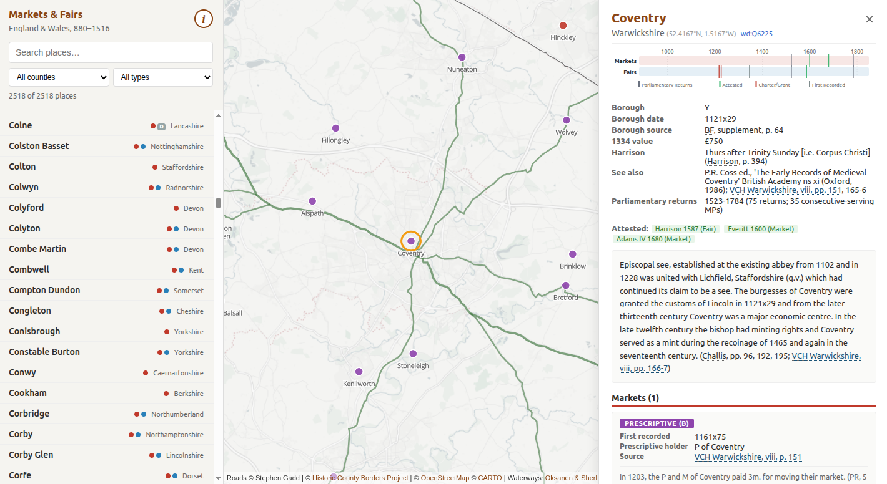

# Gazetteer of Markets and Fairs in England and Wales to 1516

A browser-based interface for the *Gazetteer of Markets and Fairs in England and Wales to 1516*, the definitive catalogue of legally-established markets and fairs in medieval England and Wales.

**[Launch the Gazetteer →](https://ihr-digital.github.io/markets-and-fairs/)**

## About

This web application provides searchable, map-based access to the original dataset deposited with the UK Data Archive as Study Number [SN 4171](https://beta.ukdataservice.ac.uk/datacatalogue/studies/study?id=4171). The dataset records over 2,400 places with evidence of at least one market or fair by 1516, comprising some 2,600 markets and 2,800 fairs across 40 historic counties of England and Wales.

The interface allows users to:

- **Search** places by name (including Welsh-language toponyms)
- **Filter** by county and by type (market, fair, or both)
- **Browse** an interactive map with historic county boundaries, navigable waterways, and c.1680 road network
- **Inspect** detailed records for each place, including charter grants, confirmations, market days, fair dates, and links to the Victoria County History on British History Online

## Original dataset

Samantha Letters, with Mario Fernandes, Derek Keene and Olwen Myhill, *Gazetteer of Markets and Fairs in England and Wales to 1516* (Kew: List and Index Society, 2003; Special Series vols 32 and 33).

Keene, D. and Letters, S., *Markets and Fairs in England and Wales to 1516* [computer file]. 2nd Edition. Colchester, Essex: UK Data Archive [distributor], July 2004. SN: 4171, http://dx.doi.org/10.5255/UKDA-SN-4171-1

© Centre for Metropolitan History, Institute of Historical Research (School of Advanced Study, University of London).

The [online edition](https://archives.history.ac.uk/gazetteer/gazweb2.html) (with updates to 2006) was maintained by the Centre for Metropolitan History and is now archived by the Institute of Historical Research.

## Original documentation

The following documentation was deposited with the original dataset and is reproduced here as PDF for reference:

| Document | Description |
|---|---|
| [Guide to the Data Collection](https://ihr-digital.github.io/markets-and-fairs/documentation/guide.pdf) | Project summary, description of sources, abbreviations, database structure, and file inventory |
| [Introduction](https://ihr-digital.github.io/markets-and-fairs/documentation/introduction.pdf) | Preface, acknowledgements, and the full scholarly introduction to the printed Gazetteer |
| [Appendix I](https://ihr-digital.github.io/markets-and-fairs/documentation/appendix_I.pdf) | Unidentified places and other places which may have had a market or fair before 1516 |
| [Appendix II](https://ihr-digital.github.io/markets-and-fairs/documentation/appendix_II.pdf) | General grants or confirmations of the right to hold a market or fair |
| [Appendix III](https://ihr-digital.github.io/markets-and-fairs/documentation/appendix_III.pdf) | Places with markets or fairs c.1600, but not recorded in the Gazetteer |
| [Appendix IV](https://ihr-digital.github.io/markets-and-fairs/documentation/appendix_IV.pdf) | Earlier county lists and maps of markets and fairs, published and unpublished |
| [List of Places](https://ihr-digital.github.io/markets-and-fairs/documentation/list_of_places.pdf) | Alphabetical list by county of the c.2,400 places with evidence of a market or fair |
| [Index of Institutions](https://ihr-digital.github.io/markets-and-fairs/documentation/index_of_institutions.pdf) | Index of religious houses, government departments, urban communities and other bodies |

## Augmentation and adaptation

The database underlying this interface was constructed by Stephen Gadd from the original tab-delimited data files, with the following enhancements:

- Coordinates converted from OS National Grid to WGS84
- County names standardised to the [Historic Counties Standard](https://historiccountiestrust.co.uk/Historic_Counties_Standard.pdf) three-letter codes
- Coordinate/county consistency checked against historic county boundary polygons and Wikidata
- Place names normalised and cross-referenced with Wikidata identifiers
- Welsh-language toponyms added from the [RCAHMW Historic Place Names of Wales](https://historicplacenames.rcahmw.gov.uk/)
- Updates from the 2006 online edition integrated
- VCH references linked to [British History Online](https://www.british-history.ac.uk)

Stephen Gadd is working on a project to extend the dataset to 1846.

## Additional data sources

- **Historic county boundaries**: [Historic County Borders Project](https://county-borders.co.uk)
- **Navigable waterways**: E. Oksanen & J. Sherborne, [*Inland Navigation in England and Wales before 1348: GIS database*](https://researchportal.helsinki.fi/en/datasets/inland-navigation-in-england-and-wales-before-1348-gis-database/) (2019)
- **Historical roads**: digitised by Stephen Gadd from John Ogilby's [*Britannia*](https://cudl.lib.cam.ac.uk/view/PR-ATLAS-00004-00067-00006/1) (1675) and Philip Lea's [*The Travellers Guide*](https://collections.britishart.yale.edu/catalog/alma:995839353408651) (c.1686)
- **Base map**: © [OpenStreetMap](https://www.openstreetmap.org/copyright) contributors, rendered with [MapLibre GL JS](https://maplibre.org/)

## Licence

The original dataset is © Centre for Metropolitan History, Institute of Historical Research. See the [Guide to the Data Collection](https://ihr-digital.github.io/markets-and-fairs/documentation/guide.pdf) for full terms.

## Acknowledgements

This interface is published by [IHR Digital](https://github.com/ihr-digital), Institute of Historical Research, School of Advanced Study, University of London.

